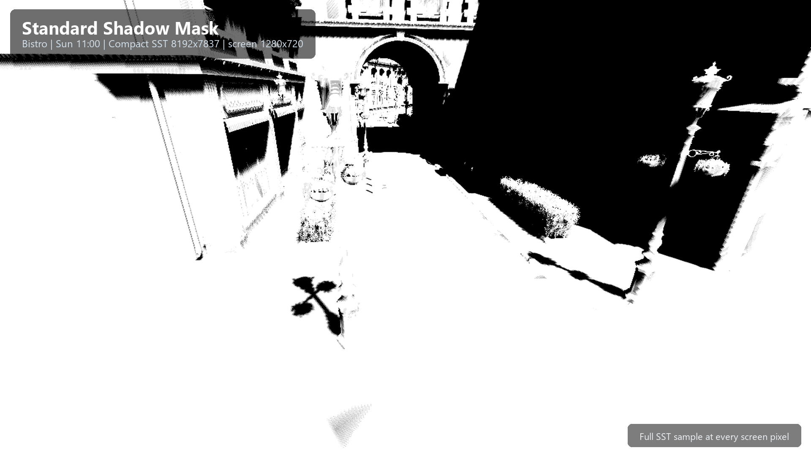
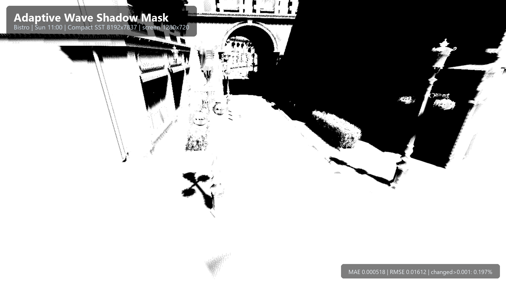
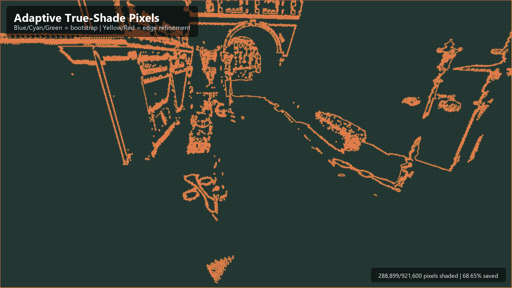
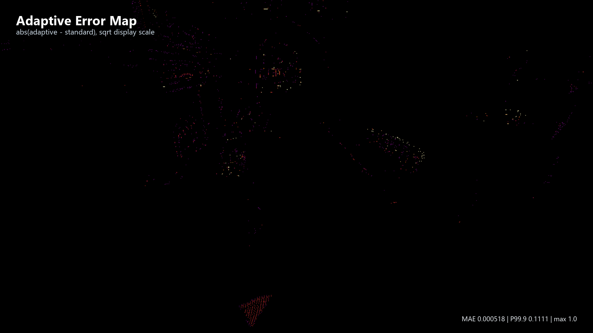

# Nan - Python + Slang GPU Path Tracer

An **educational** real-time GPU path tracing renderer built with SlangPy.


## Features

- **Simple unidirectional path tracing** - Easy to understand and extend
- **Lambert BSDF only** - No complex material models, perfect for learning
- **Headless mode** - Render without a window, ideal for AI-assisted debugging
- **Texture-space path tracing** - Progressively caches irradiance on per-triangle barycentric Mesh Colors and resolves it from any camera view
- **Surface-probe path tracing** - Builds a sparse blue-noise irradiance cache with native weighted sample elimination and point-octree reconstruction
- **Static shadow mask experiments** - Compact SST shadow queries can be sampled through a screen-space adaptive mask.

## Example: Adaptive Static Shadow Mask

Nan can pre-bake a static sun shadow map into a Compact Static Shadow Tree (SST), then sample it through a screen-space adaptive shadow mask. This Bistro capture uses an 8192-budget Compact SST at 11:00 sun time. The adaptive wave mask shades only **288,899 / 921,600** screen pixels (**31.35%**) while saving **68.65%** of shadow-mask shading work. Against the full per-pixel mask, the adaptive mask measured **MAE 0.000518**, **RMSE 0.01612**, and **0.197%** of pixels changed by more than `1e-3`.

| Standard full mask | Adaptive wave mask |
| --- | --- |
|  |  |

| Adaptive true-shade pixels | Absolute error map |
| --- | --- |
|  |  |

## Quick Start

```bash
pip install -r requirements.txt
python entry_point.py
```

## Command Line Arguments

| Argument | Description | Default |
|----------|-------------|---------|
| `--scene <path>` | Scene file path | Cornell box |
| `--headless` | Run without window | - |
| `--frames <N>` | Number of frames in headless mode | 64 |
| `--output <path>` | Output image path for headless mode | headless_output.png |
| `--width <W>` | Render width | 1920 |
| `--height <H>` | Render height | 1080 |
| `--vsync` | Enable V-Sync | - |
| `--no-srgb` | Keep linear color space in output | - |
| `--renderer path-tracing\|texture-space\|surface-probe` | Select the standard, Mesh Colors, or sparse surface-probe renderer | path-tracing |
| `--surface-probe-count <N>` | Target surface-site budget before double-sided expansion | 20480 |
| `--surface-probe-oversample <N>` | Candidate multiplier before weighted sample elimination | 5 |
| `--surface-probe-sampler-backend auto\|cpp\|python` | Weighted sample elimination backend | auto |
| `--surface-probe-profile-build` | Print sampled startup timings for scene import, WSE/repair, octree packing, GPU upload, and shader initialization | - |
| `--surface-probe-repair-budget-ratio <R>` | Maximum post-WSE deficit-repair sites relative to the base budget | 0.30 |
| `--surface-probe-repair-min-gather <N>` | Primary-radius gather count targeted by repair | 4 |
| `--surface-probe-max-density-multiplier <M>` | Clamp for adaptive density `m(x)=1/f(x)` | 8 |
| `--surface-probe-no-adaptive-wse` | Restore area-only candidate allocation and uniform-radius WSE | - |
| `--surface-probe-vertex-fallback` | Enable the legacy triangle-local vertex-irradiance fallback for A/B comparison | - |
| `--surface-probe-debug-view beauty\|count\|support\|density\|vertex-fallback\|probe-self-hit` | Initial resolve or false-color diagnostic | beauty |
| `--surface-probe-show-gather-count` | Show the false-color reconstruction-neighbor count | - |
| `--surface-probe-screen-accum` | Apply optional screen accumulation after probe resolve | - |
| `--texture-space-texels-per-unit <N>` | World-space Mesh Colors density | 16 |
| `--texture-space-min-resolution <N>` | Minimum per-triangle grid resolution | 4 |
| `--texture-space-max-resolution <N>` | Maximum per-triangle grid resolution | 64 |
| `--texture-space-max-texels <N>` | Hard irradiance-cache payload-slot budget | 16777216 |
| `--texture-space-samples-per-texel <N>` | Hemisphere samples per texel per frame | 1 |
| `--texture-space-max-bounces <N>` | Indirect texture-space path depth | 3 |

## Headless Mode

Windowless batch rendering for offline rendering or CI testing:

```bash
# Render 128 accumulated frames
python entry_point.py --headless --frames 128 --output result.png

# Custom resolution
python entry_point.py --headless --width 3840 --height 2160 --frames 256

# Preserve linear HDR data
python entry_point.py --headless --no-srgb --output linear.png
```

## Texture-Space Mode

The texture-space renderer uses the Mesh Colors parameterization from the
TransportFormer renderer: every triangle owns a barycentric lattice, so it does
not require a UV atlas, chart packing, or dilation. Irradiance accumulates in
that view-independent cache while a primary-ray resolve pass maps it back to
the current camera. Moving the camera resets only screen accumulation; changing
scene lighting or pressing **Reset Texture Irradiance** resets the texel cache.

```bash
# Interactive texture-space preview
python entry_point.py --renderer texture-space

# Low-cost headless smoke
python entry_point.py --renderer texture-space --headless --frames 16 \
  --width 512 --height 512 --texture-space-texels-per-unit 8 \
  --output texture-space.png
```

Large scenes should use a conservative density and resolution cap. Layout
creation fails with a clear error instead of allocating beyond
`--texture-space-max-texels`. Every surface texel owns one 16-byte front
irradiance slot. Only materials explicitly marked `double_sided` allocate and
trace an additional 16-byte back slot, so single-sided geometry has no
double-sided cache overhead. glTF `doubleSided` is preserved during material
import; other material sources default to single-sided.

## Surface-Probe Mode

The surface-probe renderer first estimates compatible surface support `f(x)`
with the real reconstruction kernel. It allocates the exact base budget by
`area*m(x)`, draws triangle candidates from the same density (including all
triangle centroids), and applies variable-radius weighted sample elimination.
The per-candidate radius is proportional to
`sqrt(mean(m) / m(x))`, so the requested density changes without changing the
base-site total. A post-WSE audit then evaluates
the same radius, normal, plane, and compact-kernel tests used by the GPU gather.
It greedily appends probes to low-support boundary, narrow, disconnected, and
high-curvature regions, up to 30% of the base site count by default. The base
Poisson distribution and kernel radius are left unchanged. A final protected
coverage-closure pass takes audit points that still have zero primary-radius
support, creates enough colocated face-local sites to target four gathered
probes, and appends them without another WSE pass or the ordinary 30% repair
cap. Face-local inset triangle corners are included in the audit so seams and
small triangles cannot rely only on random candidates. Primary hits
reconstruct progressively traced irradiance through one point octree per scene
instance. Resolve retains the 96 strongest geometric candidates and
reconstructs from the strongest 32 compatible probes. If
the primary radius produces fewer than the configured minimum gather count,
the double-radius fallback contributes unique, downweighted samples.
The post-WSE deficit repair and runtime resolve use the same distance, normal,
plane, compact-kernel, 96-candidate, and 32-gather rules. Protected sites enter
the same point octree, compact kernel, and normalized reconstruction as base
and ordinary repair sites. The older
per-vertex barycentric fallback is now disabled by default because it forms a
separate piecewise-linear estimator. It remains available through
`--surface-probe-vertex-fallback` for A/B tests; only then are vertex anchors
allocated and progressively traced.

```bash
# Interactive preview with 37k surface sites
python entry_point.py --renderer surface-probe --surface-probe-count 37000

# Inspect reconstruction coverage; one frame is sufficient
python entry_point.py --renderer surface-probe --surface-probe-count 37000 \
  --surface-probe-debug-view count --headless --frames 1 \
  --width 512 --height 512 --output surface_probe_gather.png

# Inspect compatible surface support f(x) or its inverse density m(x)
python entry_point.py --renderer surface-probe --surface-probe-count 37000 \
  --surface-probe-debug-view support --headless --frames 1 \
  --width 512 --height 512 --output surface_probe_support.png
```

The interactive Surface Probe UI exposes the reconstruction diagnostics through the
`Debug View` combo. `f(x)` is the compatible surface area under the actual
distance/normal/plane reconstruction kernel, normalized by the infinite-flat-
surface kernel integral `pi*R^2/3`. `m(x)` is `clamp(1/f(x), 1, M)` and uses a
logarithmic false-color scale.
Probe reconstruction intentionally performs no query-to-probe visibility
test. `Probe Self-hit Rate` counts
probe-path bounce hits that return to the source primitive, or hit the same
instance within four times the actual ray-origin offset, and displays the
weighted suspects per probe update on a logarithmic scale.
`Vertex Fallback Weight` shows where the triangle-local result contributes;
when launched with `--surface-probe-vertex-fallback`, the UI checkbox toggles
that legacy path without rebuilding the layout.

Adaptive WSE is enabled by default. Its native implementation computes initial
candidate weights in parallel and uses an indexed mutable heap for exact
neighbor-weight updates. When a candidate is eliminated, its contribution is
removed using each surviving neighbor's own local radius; this asymmetric rule
prevents coarse-radius regions from incorrectly suppressing fine-detail sites.

`auto` prefers the native C++ sampler and falls back to the Python reference
implementation only when the native library cannot be built or loaded. The
native target is compiled lazily through CMake and requires a C++17 compiler.
Use `--surface-probe-sampler-backend cpp` to require it or `python` for parity
and regression testing. The native backend vendors the MIT-licensed cyCodeBase
weighted sample elimination headers at a fixed upstream commit.

## Adding a New Render Pass

### 1. Create Slang Shader

```slang
// my_pass.slang
struct MyPass {
    Texture2D<float4> input;
    RWTexture2D<float4> output;

    void execute(uint2 pixel) {
        float4 color = input[pixel];
        // Processing logic
        output[pixel] = color;
    }
}

ParameterBlock<MyPass> g_my_pass;

[shader("compute")]
[numthreads(8, 8, 1)]
void compute_main(uint3 tid: SV_DispatchThreadID) {
    g_my_pass.execute(tid.xy);
}
```

### 2. Create Python Wrapper

```python
# my_pass.py
import slangpy as spy

class MyPass:
    def __init__(self, device: spy.Device):
        self.device = device
        self.program = device.load_program("my_pass.slang", ["compute_main"])
        self.kernel = device.create_compute_kernel(self.program)

    def execute(
        self,
        command_encoder: spy.CommandEncoder,
        input: spy.Texture,
        output: spy.Texture,
    ):
        self.kernel.dispatch(
            thread_count=[input.width, input.height, 1],
            vars={
                "g_my_pass": {
                    "input": input,
                    "output": output,
                }
            },
            command_encoder=command_encoder,
        )
```

## Adding a New Renderer

Implement the `Renderer` protocol:

```python
# my_renderer.py
import slangpy as spy
from scene import Scene
from render_data import RenderData
from my_pass import MyPass
from tone_mapper import ToneMapper

class MyRenderer:
    def initialize(self, device: spy.Device, scene: Scene):
        self.device = device
        self.scene = scene
        self.my_pass = MyPass(device)
        self.tone_mapper = ToneMapper(device)
        
        # Subscribe to events (optional)
        scene.event_distpacher.subscribe("camera_move", self.on_camera_move)

    def on_camera_move(self, data):
        # Handle camera movement
        pass

    def render(
        self,
        command_encoder: spy.CommandEncoder,
        output: spy.Texture,
        frame: int,
        device: spy.Device,
        scene: Scene,
        render_data: RenderData,
    ):
        # Get/create intermediate textures from render_data
        temp_texture = render_data.get_texture(
            "my_renderer.temp",
            width=output.width,
            height=output.height,
            format=spy.Format.rgba32_float,
            usage=spy.TextureUsage.shader_resource | spy.TextureUsage.unordered_access,
        )
        
        # Pass chain
        self.my_pass.execute(command_encoder, scene.env_map, temp_texture)
        self.tone_mapper.execute(command_encoder, temp_texture, output)

    def setup_ui(self, ui_context: spy.ui.Context, ui_window: spy.ui.Window):
        # Add UI controls (optional)
        pass
```

Use in `entry_point.py`:

```python
from my_renderer import MyRenderer

def main():
    renderer = MyRenderer()
    app = App(config=config)
    app.set_renderer(renderer)
    app.main_loop()
```

## Hotkeys

| Key | Function |
|-----|----------|
| `WASD` + Mouse | Camera control |
| `F1` | TEV viewer |
| `F2` | Screenshot |
| `F11` | RenderDoc capture |
| `Esc` | Quit |
