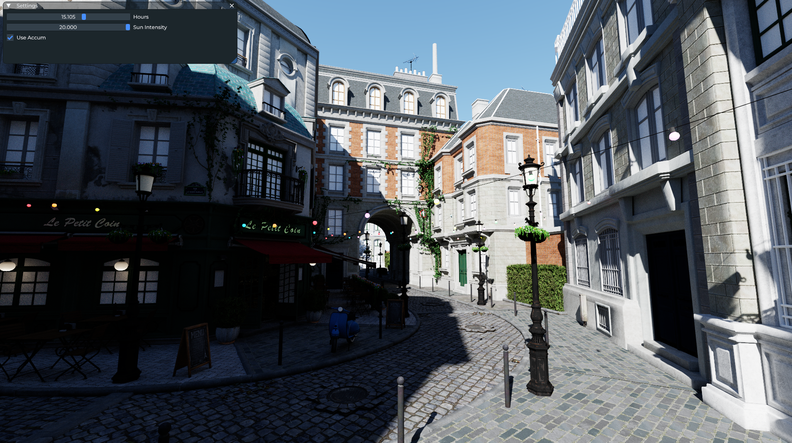

# Nan - Python + Slang GPU Path Tracer

A real-time GPU path tracing renderer built with SlangPy.



## Quick Start

```bash
pip install -r requirements.txt
python entry_point.py
```

## Command Line Arguments

| Argument | Description | Default |
|----------|-------------|---------|
| `--scene <path>` | Scene file path (.json or model file) | Cornell box |
| `--headless` | Run without window | - |
| `--frames <N>` | Number of frames in headless mode | 64 |
| `--output <path>` | Output image path for headless mode | headless_output.png |
| `--width <W>` | Render width | 1920 |
| `--height <H>` | Render height | 1080 |
| `--vsync` | Enable V-Sync | - |
| `--no-srgb` | Keep linear color space in output | - |

## Headless Mode

Windowless batch rendering for offline rendering or CI testing:

```bash
# Render 128 accumulated frames
python entry_point.py --headless --frames 128 --output result.png

# Custom resolution
python entry_point.py --headless --width 3840 --height 2160 --frames 256

# Preserve linear HDR data
python entry_point.py --headless --no-srgb --output linear.png
```

## Adding a New Render Pass

### 1. Create Slang Shader

```slang
// my_pass.slang
struct MyPass {
    Texture2D<float4> input;
    RWTexture2D<float4> output;

    void execute(uint2 pixel) {
        float4 color = input[pixel];
        // Processing logic
        output[pixel] = color;
    }
}

ParameterBlock<MyPass> g_my_pass;

[shader("compute")]
[numthreads(8, 8, 1)]
void compute_main(uint3 tid: SV_DispatchThreadID) {
    g_my_pass.execute(tid.xy);
}
```

### 2. Create Python Wrapper

```python
# my_pass.py
import slangpy as spy

class MyPass:
    def __init__(self, device: spy.Device):
        self.device = device
        self.program = device.load_program("my_pass.slang", ["compute_main"])
        self.kernel = device.create_compute_kernel(self.program)

    def execute(
        self,
        command_encoder: spy.CommandEncoder,
        input: spy.Texture,
        output: spy.Texture,
    ):
        self.kernel.dispatch(
            thread_count=[input.width, input.height, 1],
            vars={
                "g_my_pass": {
                    "input": input,
                    "output": output,
                }
            },
            command_encoder=command_encoder,
        )
```

## Adding a New Renderer

Implement the `Renderer` protocol:

```python
# my_renderer.py
import slangpy as spy
from scene import Scene
from render_data import RenderData
from my_pass import MyPass
from tone_mapper import ToneMapper

class MyRenderer:
    def initialize(self, device: spy.Device, scene: Scene):
        self.device = device
        self.scene = scene
        self.my_pass = MyPass(device)
        self.tone_mapper = ToneMapper(device)
        
        # Subscribe to events (optional)
        scene.event_distpacher.subscribe("camera_move", self.on_camera_move)

    def on_camera_move(self, data):
        # Handle camera movement
        pass

    def render(
        self,
        command_encoder: spy.CommandEncoder,
        output: spy.Texture,
        frame: int,
        device: spy.Device,
        scene: Scene,
        render_data: RenderData,
    ):
        # Get/create intermediate textures from render_data
        temp_texture = render_data.get_texture(
            "my_renderer.temp",
            width=output.width,
            height=output.height,
            format=spy.Format.rgba32_float,
            usage=spy.TextureUsage.shader_resource | spy.TextureUsage.unordered_access,
        )
        
        # Pass chain
        self.my_pass.execute(command_encoder, scene.env_map, temp_texture)
        self.tone_mapper.execute(command_encoder, temp_texture, output)

    def setup_ui(self, ui_context: spy.ui.Context, ui_window: spy.ui.Window):
        # Add UI controls (optional)
        pass
```

Use in `entry_point.py`:

```python
from my_renderer import MyRenderer

def main():
    renderer = MyRenderer()
    app = App(config=config)
    app.set_renderer(renderer)
    app.main_loop()
```

## Hotkeys

| Key | Function |
|-----|----------|
| `WASD` + Mouse | Camera control |
| `F1` | TEV viewer |
| `F2` | Screenshot |
| `F11` | RenderDoc capture |
| `Esc` | Quit |
